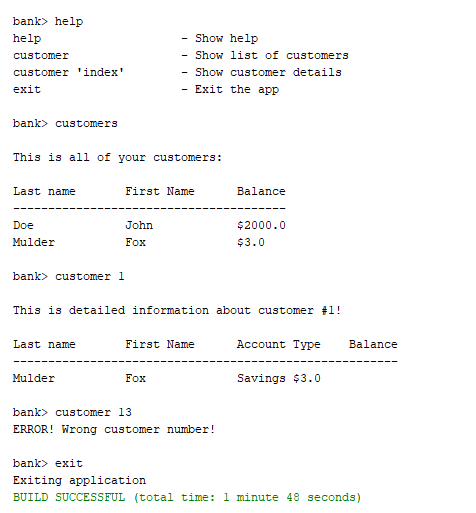

# UI Lab 2 
Виконала Жаботинська Софія, студентка 35 групи

В power shell на жаль не вдалось запустити програму, тому запуск був у звичайний спосіб
## Завдання на 3



## Завдання на 4


*код майже той самий, що і на 5, але не містить методу generateCustomerReport() та інших рядків для report
## Завдання на 5


### Код, що містить CLIdemo.java:
```java
package domain;

import com.mybank.domain.Bank;
import com.mybank.domain.CheckingAccount;
import com.mybank.domain.Customer;
import com.mybank.domain.SavingsAccount;
import java.io.PrintWriter;
import java.util.LinkedList;
import java.util.List;
import com.mybank.reporting.CustomerReport;
import java.io.BufferedReader;
import java.io.FileReader;
import java.io.IOException;

import org.jline.reader.*;
import org.jline.reader.impl.completer.*;
import org.jline.utils.*;
import org.fusesource.jansi.*;

/**
 * Sample application to show how jLine can be used.
 *
 * @author sandarenu
 *
 */
/**
 * Console client for 'Banking' example
 *
 * @author Alexander 'Taurus' Babich
 */
public class CLIdemo {

    public static final String ANSI_RESET = "\u001B[0m";
    public static final String ANSI_BLACK = "\u001B[30m";
    public static final String ANSI_RED = "\u001B[31m";
    public static final String ANSI_GREEN = "\u001B[32m";
    public static final String ANSI_YELLOW = "\u001B[33m";
    public static final String ANSI_BLUE = "\u001B[34m";
    public static final String ANSI_PURPLE = "\u001B[35m";
    public static final String ANSI_CYAN = "\u001B[36m";
    public static final String ANSI_WHITE = "\u001B[37m";

    private String[] commandsList;

    /**
     * Ініціалізація списку команд.
     */
    public void init() {
        commandsList = new String[]{"help", "customers", "customer", "report", "exit"};
    }

    /**
     * Запуск програми. Ініціалізує консоль та обробляє введені команди.
     */
    public void run() {
        AnsiConsole.systemInstall(); // needed to support ansi on Windows cmd
        printWelcomeMessage();
        LineReaderBuilder readerBuilder = LineReaderBuilder.builder();
        List<Completer> completors = new LinkedList<Completer>();

        completors.add(new StringsCompleter(commandsList));
        readerBuilder.completer(new ArgumentCompleter(completors));

        LineReader reader = readerBuilder.build();

        String line;

        while ((line = readLine(reader, "")) != null) {
            if ("help".equals(line)) {
                printHelp();
            } else if ("customers".equals(line)) {
                AttributedStringBuilder a = new AttributedStringBuilder()
                        .append("\nThis is all of your ")
                        .append("customers", AttributedStyle.BOLD.foreground(AttributedStyle.RED))
                        .append(":");

                System.out.println(a.toAnsi());
                if (Bank.getNumberOfCustomers() > 0) {
                    System.out.println("\nLast name\tFirst Name\tBalance");
                    System.out.println("---------------------------------------");
                    for (int i = 0; i < Bank.getNumberOfCustomers(); i++) {
                        System.out.println(Bank.getCustomer(i).getLastName() + "\t\t" + Bank.getCustomer(i).getFirstName() + "\t\t$" + Bank.getCustomer(i).getAccount(0).getBalance());
                    }
                } else {
                    System.out.println(ANSI_RED + "Your bank has no customers!" + ANSI_RESET);
                }

            } else if (line.indexOf("customer") != -1) {
                try {
                    int custNo = 0;
                    if (line.length() > 8) {
                        String strNum = line.split(" ")[1];
                        if (strNum != null) {
                            custNo = Integer.parseInt(strNum);
                        }
                    }
                    Customer cust = Bank.getCustomer(custNo);
                    String accType = cust.getAccount(0) instanceof CheckingAccount ? "Checkinh" : "Savings";

                    AttributedStringBuilder a = new AttributedStringBuilder()
                            .append("\nThis is detailed information about customer #")
                            .append(Integer.toString(custNo), AttributedStyle.BOLD.foreground(AttributedStyle.RED))
                            .append("!");

                    System.out.println(a.toAnsi());

                    System.out.println("\nLast name\tFirst Name\tAccount Type\tBalance");
                    System.out.println("-------------------------------------------------------");
                    System.out.println(cust.getLastName() + "\t\t" + cust.getFirstName() + "\t\t" + accType + "\t$" + cust.getAccount(0).getBalance());
                } catch (Exception e) {
                    System.out
                            .println(ANSI_RED + "ERROR! Wrong customer number!" + ANSI_RESET);
                }
            } else if ("exit".equals(line)) {
                System.out.println("Exiting application");
                return;
            } else if ("report".equals(line)) {
                System.out.println("Creating report...");
                generateCustomerReport();
            } else {
                System.out
                        .println(ANSI_RED + "Invalid command, For assistance press TAB or type \"help\" then hit ENTER." + ANSI_RESET);
            }
        }

        AnsiConsole.systemUninstall();
    }

    /**
     * Генерація звіту про клієнтів.
     */
    private void generateCustomerReport() {
        CustomerReport custReport = new CustomerReport();
        custReport.generateReport();
    }

    /**
     * Виведення вітального повідомлення.
     */
    private void printWelcomeMessage() {
        System.out
                .println("\nWelcome to " + ANSI_GREEN + " MyBank Console Client App" + ANSI_RESET + "! \nFor assistance press TAB or type \"help\" then hit ENTER.");

    }

    /**
     * Виведення списку доступних команд.
     */
    private void printHelp() {
        System.out.println("help\t\t\t- Show help");
        System.out.println("customer\t\t- Show list of customers");
        System.out.println("customer \'index\'\t- Show customer details");
        System.out.println("report\t\t\t- Show customers report");
        System.out.println("exit\t\t\t- Exit the app");

    }

    /**
     * Читання рядка з введення користувача.
     *
     * @param reader LineReader для читання вводу
     * @param promtMessage Повідомлення перед вводом
     * @return Введений рядок
     */
    private String readLine(LineReader reader, String promtMessage) {
        try {
            String line = reader.readLine(promtMessage + ANSI_YELLOW + "\nbank> " + ANSI_RESET);
            return line.trim();
        } catch (UserInterruptException | EndOfFileException e) {
            return null;
        }

    }

    /**
     * Основний метод для запуску програми. Завантажує дані клієнтів з файлу та
     * запускає інтерфейс командного рядка.
     *
     * @param args аргументи командного рядка
     */
    public static void main(String[] args) {
        try (BufferedReader reader = new BufferedReader(new FileReader("CLIdemo\\data\\test.dat"))) {
            String line;
            while ((line = reader.readLine()) != null) {
                String[] parts = line.split("\t");
                if (parts.length == 3) {
                    String firstName = parts[0];
                    String lastName = parts[1];
                    int numAccounts = Integer.parseInt(parts[2]);
                    Bank.addCustomer(firstName, lastName);
                    for (int i = 0; i < numAccounts; i++) {
                        line = reader.readLine();
                        parts = line.split("\t");
                        if (parts[0].equals("S")) {
                            double balance = Double.parseDouble(parts[1]);
                            double interestRate = Double.parseDouble(parts[1]);
                            Bank.getCustomer(Bank.getNumberOfCustomers() - 1).addAccount(new SavingsAccount(balance, interestRate));
                        } else {
                            double balance = Double.parseDouble(parts[1]);
                            double overdraftLimit = Double.parseDouble(parts[2]);
                            Bank.getCustomer(Bank.getNumberOfCustomers() - 1).addAccount(new CheckingAccount(balance, overdraftLimit));
                        }
                    }
                }
            }
        } catch (IOException e) {
            e.printStackTrace();
        }

        CLIdemo shell = new CLIdemo();
        shell.init();
        shell.run();
    }
}

```
